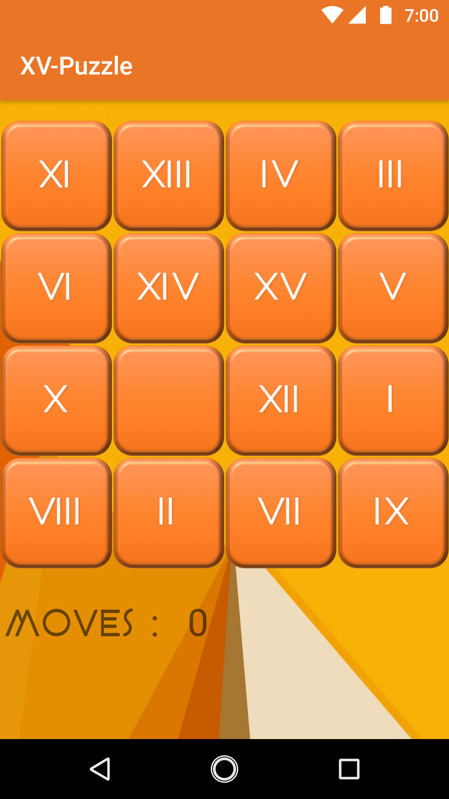

# XV-Puzzle


This is a simple 15-Puzzle Implemntation on Android to be submitted as Assignment 1 for GAME-2011

<p align="center">
  
</p>

## NOTE

To get an easy win condition, in onCreate Method of PlayActivity, add the following code:

```sh
puzzle.generateCloseToWinConditionPuzzle();
```
